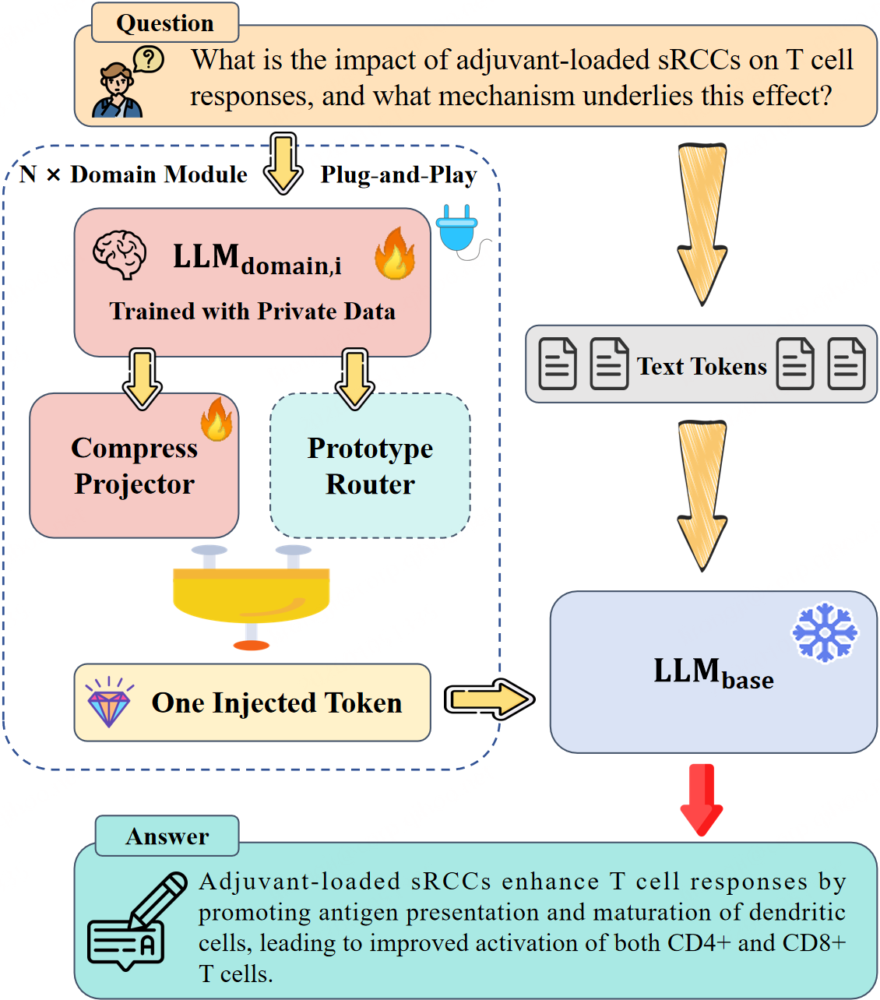

# GAG

[](https://arxiv.org/abs/2601.08209)
[](https://huggingface.co/datasets/rongjili/GAG)

## Abstract

In domains such as biomedicine, materials, and finance, high-stakes deployment of large language models (LLMs) requires injecting private, domain-specific knowledge that is proprietary, fast-evolving, and under-represented in public pretraining. However, the two dominant paradigms for private knowledge injection each have pronounced drawbacks: fine-tuning is expensive to iterate, and continual updates risk catastrophic forgetting and general-capability regression; retrieval-augmented generation (RAG) keeps the base model intact but is brittle in specialized private corpora due to chunk-induced evidence fragmentation, retrieval drift, and long-context pressure that yields query-dependent prompt inflation. Inspired by how multimodal LLMs align heterogeneous modalities into a shared semantic space, we propose **Generation-Augmented Generation (GAG)**, which treats private expertise as an additional expert modality and injects it via a compact, representation-level interface aligned to the frozen base model, avoiding prompt-time evidence serialization while enabling plug-and-play specialization and scalable multi-domain composition with reliable selective activation. Across two private scientific QA benchmarks (immunology adjuvant and catalytic materials) and mixed-domain evaluations, GAG improves specialist performance over strong RAG baselines by **15.34%** and **14.86%** on the two benchmarks, respectively, while maintaining performance on six open general benchmarks and enabling near-oracle selective activation for scalable multi-domain deployment.

- **Base Model (LLM1):** Qwen3-8B (frozen)
- **Domain Expert ($LLM2_i$):** Qwen3-1.7B (per-domain)
- **Method:** Two-stage GAG (expert adaptation → projector alignment) with built-in PPR routing
- **Knowledge Interface:** One-token continuous injection (constant budget)
- **Training / Launch:** `accelerate` multi-GPU (bf16 recommended)

## Overview

<p align="center">
  
</p>

**Figure 2.** GAG overview. A training-free prototype router selects either the general route or one of *N* plug-and-play domain modules. Each module derives an expert readout from a specific expert model and projects it into the base model’s embedding space as a single continuous injected token, enabling constant-budget, retrieval-free knowledge injection under a frozen base model.

---

## Environment Setup

Install dependencies:

```bash
pip install -r requirements.txt
```

Login to Weights & Biases (if you use wandb logging):

```
wandb login
```

Configure distributed training once:

```
accelerate config
```

## Training

### Stage I: Domain Expert Adaptation

We train the domain expert ($LLM2_i$) in Stage I using LLaMAFactory:

```
FORCE_TORCHRUN=1 llamafactory-cli train config/gag_train/stageI.yaml
```

Update the YAML to set data/model paths, output directory, and training hyperparameters.

### Stage II: Projector Alignment

Before Stage II, use the Stage I expert model to prepare background knowledge embeddings for domain questions:

```
cd /path/to/your/GAG/repo
export PYTHONPATH=$PWD:$PYTHONPATH
python src/language_modeling/get_background_embedding.py
```

Then run Stage II projector alignment (bf16, 8 GPUs):

```
accelerate launch \
    --mixed_precision bf16 \
    --num_machines 1 \
    --num_processes 8 \
    --main_process_port 29666 \
    -m \
    src.language_modeling.train \
    --config config/gag_train/stageII.yaml
```

Update the YAML to set data/model paths, output directory, and training hyperparameters.

## Evaluation

### Oracle-GAG Evaluation

```
chmod +x src/eval/oracle_gag/start_run_eval_oracle_gag.sh
bash src/eval/oracle_gag/start_run_eval_oracle_gag.sh
```

### GAG Evaluation (Multi-domain)

First build domain prototypes:

```
python -m src.ppr.build_domain_prototypes
```

Then run GAG eval:

```
chmod +x src/eval/gag/start_run_eval_gag.sh
bash src/eval/gag/start_run_eval_gag.sh
```

### PPR Accuracy Evaluation

```
python -m src.eval.gag.eval_ppr_accuracy \
  --encoder_name_or_path path/to/Qwen3-1.7B \
  --general_proto path/to/general_prototypes.pt \
  --adjuvant_proto path/to/adjuvant_prototypes.pt \
  --material_proto path/to/material_prototypes.pt \
  --aviation_proto path/to/aviation_prototypes.pt \
  --law_proto path/to/law_prototypes.pt \
  --math_proto path/to/math_prototypes.pt \
  --eval_jsonl path/to/ppr_eval_queries.jsonl \
  --output_report path/to/ppr_eval_report.json
```

## Related Tools

- [MinerU](https://github.com/opendatalab/MinerU): Document parsing toolkit for converting scientific PDFs into structured text, commonly used to build high-quality domain corpora for retrieval/indexing.
- [ColBERT](https://github.com/stanford-futuredata/ColBERT): Late-interaction neural retrieval framework; used for dense retrieval over large corpora (e.g., ColBERTv2) in RAG-style baselines.
- [HuggingFace Accelerate](https://github.com/huggingface/accelerate): Lightweight launcher for distributed/multi-GPU training and evaluation.
- [FlashAttention](https://github.com/Dao-AILab/flash-attention): Efficient attention kernels to accelerate training/inference for long sequences.
- [LLaMA-Factory](https://github.com/hiyouga/LLaMA-Factory): Training toolkit used for Stage I domain expert adaptation (SFT/LoRA/Full fine-tuning).

## Citation

If you find this work helpful, please cite the paper:

```bibtex
@article{li2026generation,
  title={Generation-Augmented Generation: A Plug-and-Play Framework for Private Knowledge Injection in Large Language Models},
  author={Li, Rongji and Xu, Jian and Chen, Xueqing and Yang, Yisheng and Wang, Jiayi and Chen, Xingyu and Xie, Chunyu and Leng, Dawei and Zhang, Xu-Yao},
  journal={arXiv preprint arXiv:2601.08209},
  year={2026}
}
```

