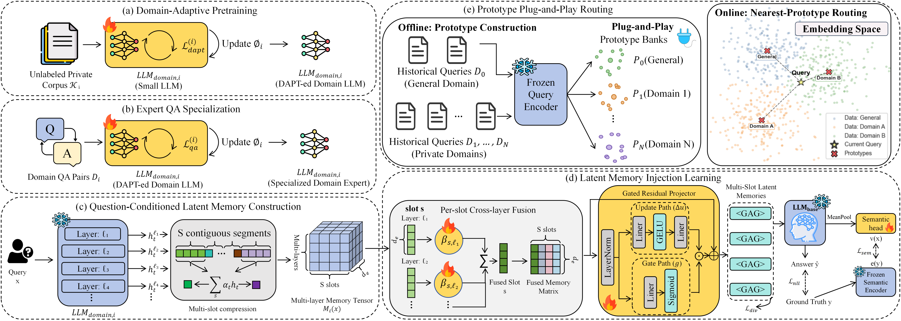

# GAG

[](https://arxiv.org/abs/2601.08209)
[](https://huggingface.co/datasets/rongjili/GAG)

This repository contains the official implementation of `GAG`, together with the `PPR` (Prototype-based Plug-and-play Routing) module for mixed-domain routing.

## Abstract

In domains such as materials science, biomedicine, and finance, high-stakes deployment of large language models (LLMs) requires injecting private, domain-specific knowledge that is proprietary, fast-evolving, and under-represented in public pretraining. However, the two dominant paradigms for private knowledge injection each have clear drawbacks: fine-tuning is expensive to iterate under continual updates that can induce catastrophic forgetting and general-capability regression; retrieval-augmented generation (RAG) keeps the base model intact but remains brittle in specialized private corpora due to chunk-induced evidence fragmentation, retrieval mismatch, and long-context pressure. Inspired by how multimodal LLMs align heterogeneous modalities into a shared semantic space, we propose **Generation-Augmented Generation (GAG)**, which treats private expertise as an auxiliary modality and injects it into a frozen base model through a compact, constant-budget latent interface. Concretely, GAG distills question-conditioned specialist knowledge from lightweight domain experts into **multi-slot latent memories**, integrates multi-layer expert signals via **per-slot cross-layer fusion**, and aligns them to the frozen base model through **gated residual projection**, while supporting scalable mixed-domain deployment with reliable selective activation. In a unified mixed-domain evaluation spanning two scientific private-domain QA benchmarks (catalytic materials and immunology adjuvant) together with general-domain queries, GAG consistently outperforms strong retrieval-based and parameter-efficient fine-tuning baselines on specialist QA, while preserving general-domain capability, achieving highly reliable routing, and offering a favorable efficiency-effectiveness trade-off. 

## Overview



**Figure 3. Detailed methodology of GAG.** (a) Domain-Adaptive Pretraining learns a specialist corpus prior from unlabeled private data. (b) Expert QA Specialization turns the same small model into a query-aware domain expert. (c) The expert's generated hidden trajectories are compressed into a stabilized multi-layer memory tensor. (d) Injection-side learning performs per-slot cross-layer fusion, gated residual projection, and joint optimization with L<sub>nll</sub>, L<sub>sem</sub>, and L<sub>div</sub> to align latent memories to the frozen base model. (e) Prototype Plug-and-Play Routing builds prototype banks offline and selects routes online by nearest-prototype matching for training-free incremental deployment.

## Repository Layout

- `src/domain_adaptation/`: Stage I domain-adaptive pretraining and Stage II expert QA-SFT for the expert small model
- `src/data_pipeline/`: background knowledge generation, multi-layer hidden-state extraction, and compact memory compression
- `src/language_modeling/`: slot construction, per-slot layer mixing, gated residual projector, and injection-side training
- `src/eval/oracle_gag/`: single-domain `GAG` inference
- `src/eval/compute_generation_metrics.py`: BERTScore / STS evaluation for generated answers
- `src/ppr/`: offline prototype construction and online routing
- `src/eval/ppr/`: routing evaluation and mixed-domain routed inference
- `config/`: materials-domain, adjuvant-domain, and PPR routing configs
- `scripts/`: minimal entry points for training and inference

## Installation

The codebase is tested with `Python 3.10`.

```bash
conda create -n gag python=3.10 -y
conda activate gag
```

Install a CUDA-enabled PyTorch build that matches your local environment, then install the remaining dependencies:

```bash
pip install torch
pip install -r requirements.txt
```

If `datasets/` is stored alongside this repository, create a symbolic link from the code root:

```bash
ln -s ../datasets datasets
```

## Expected Local Directory Structure

The training and inference scripts assume the following local layout:

```text
models/
  Qwen3-1.7B/
  Qwen3-8B/
  scibert_scivocab_uncased/
  all-mpnet-base-v2/
datasets/
  materials_domain/
    material_domain_knowledge_base_cleaned.jsonl
    RSC_3661_refined_train.jsonl
    RSC_646_refined_dev.jsonl
  adjuvant_domain/
    final_pretrain_data_cleaned.jsonl
    adjuvant_rebalanced_train_21614.jsonl
    adjuvant_rebalanced_test_1294.jsonl
  mixed_domain/
    offline/
      general.jsonl
      materials.jsonl
      adjuvant.jsonl
    online/
      general_and_adjuvant_and_materials.jsonl
outputs/
```

The repository does not ship model checkpoints. Generated expert checkpoints, background memories, prototype banks, and inference outputs are written under `outputs/`.

The released scripts expect the following local model assets:

- `models/Qwen3-1.7B`: expert small model initialization and PPR router encoder
- `models/Qwen3-8B`: frozen base model for `GAG` and the general answering path
- `models/scibert_scivocab_uncased`: semantic encoder for Stage III and BERTScore evaluation
- `models/all-mpnet-base-v2`: sentence encoder for `STS`

The default Stage III configs disable FlashAttention to keep the released setup runnable without extra CUDA extension installation. If your environment already provides `flash-attn`, you may set `use_flash_attn: true` in the corresponding YAML config for faster training.

## Method Overview

`GAG` follows a three-stage training pipeline:

1. `Stage I`: domain-adaptive pretraining for the expert small model
2. `Stage II`: expert QA-SFT for background-knowledge generation
3. `Stage III`: injection-side training for the frozen `Qwen3-8B` backbone

The implementation uses:

- four-slot latent memories
- multi-layer memory construction with per-slot layer mixing
- a gated residual projector
- `NLL + semantic alignment + diversity regularization`

## Materials-Domain Workflow

```bash
bash scripts/run_material_dapt.sh
bash scripts/run_material_sft.sh
bash scripts/run_material_build_train_backgrounds.sh
bash scripts/run_material_build_eval_backgrounds.sh
bash scripts/run_material_stage3.sh
bash scripts/run_material_eval.sh
bash scripts/run_material_metrics.sh
```

For a quick smoke test, you can override the expensive stages with smaller budgets, for example:

```bash
CUDA_VISIBLE_DEVICES=0 \
NPROC_PER_NODE=1 \
python -m torch.distributed.run --standalone --nproc_per_node=1 \
  -m src.domain_adaptation.continue_pretrain \
  --config config/domain_adaptation/material_dapt_qwen3_1p7b.yaml \
  --max_samples 16 \
  --max_train_steps 1 \
  --validation_split_ratio 0.0 \
  --report_to none
```

## Adjuvant-Domain Workflow

```bash
bash scripts/run_adjuvant_dapt.sh
bash scripts/run_adjuvant_sft.sh
bash scripts/run_adjuvant_build_train_backgrounds.sh
bash scripts/run_adjuvant_build_eval_backgrounds.sh
bash scripts/run_adjuvant_stage3.sh
bash scripts/run_adjuvant_eval.sh
bash scripts/run_adjuvant_metrics.sh
```

## PPR Routing Workflow

```bash
bash scripts/run_ppr_build_prototypes.sh
bash scripts/run_ppr_eval_router.sh
bash scripts/run_ppr_mixed_domain_eval.sh
```

The routing configuration is defined in `config/ppr/mixed_domain_router.yaml`. The router assigns each incoming query to `general`, `materials`, or `adjuvant`, dispatches the query to the corresponding answering path, and then computes mixed-domain evaluation metrics. In the mixed-domain setting, `material` and `adjuvant_qa` are evaluated with `BERTScore` and `STS`, while the six general-domain QA subsets are evaluated with `EM`.

## Citation

If you find this work helpful, please cite the paper:

```bibtex
@article{li2026generation,
  title={Generation-Augmented Generation: A Plug-and-Play Framework for Private Knowledge Injection in Large Language Models},
  author={Li, Rongji and Xu, Jian and Chen, Yi and Chen, Xueqing and Yang, Yisheng and Wang, Jiayi and Chen, Xingyu and Xie, Chunyu and Leng, Dawei and Zhang, Xu-Yao},
  journal={arXiv preprint arXiv:2601.08209},
  year={2026}
}
```
